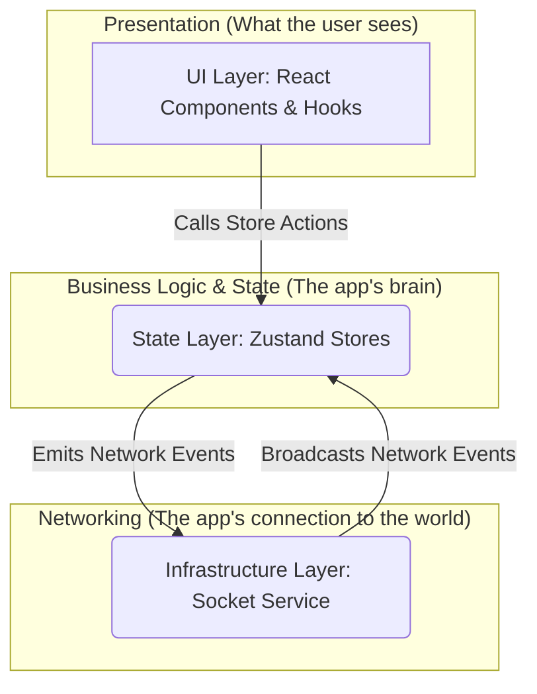

# Realtime Expo App - V2 Architecture

This document outlines a refined, professional-grade architecture for a scalable real-time application. It is designed to be modular, testable, and maintainable.

## The Three-Layer Decoupled Architecture

The core principle is a strict, unidirectional data flow built on three distinct layers. Each layer has a single responsibility and is designed to be unaware of the layers "above" it (e.g., the networking layer has no knowledge of the UI).



### 1. Infrastructure Layer (`services/socketService.ts`)

-   **Responsibility**: Manage the raw WebSocket connection and nothing else. This layer is the foundation.
-   **Key Characteristics**:
    -   **Unaware**: Has no knowledge of Zustand, React, or any application-specific logic. It only knows how to connect and communicate.
    -   **Stateless**: It does not hold any application state.
    -   **Typed API**: Provides a clean, TypeScript-powered API (`connect`, `emit`, `subscribe`) for other parts of the app to use.

### 2. State Layer (`store/*.ts`)

-   **Responsibility**: Manage all application state and business logic. This is the "source of truth" for the entire application.
-   **Key Characteristics**:
    -   **Centralized**: Built with Zustand stores (e.g., `useChatStore`, `useConnectionStore`). All application data lives here.
    -   **Reactive**: It **subscribes** to events from the Infrastructure Layer. When a message arrives from the server, the store catches the event and updates its own state.
    -   **Action-Oriented**: Provides actions that the UI layer can call (e.g., `sendMessage`). If an action needs to talk to the server, it uses the Infrastructure Layer's API.

### 3. UI Layer (`app/**/*.tsx`, `hooks/*.ts`)

-   **Responsibility**: Render the UI and handle user interactions. This layer is all about what the user sees and does.
-   **Key Characteristics**:
    -   **Declarative**: React components read data directly from the State Layer (Zustand stores) and "react" to changes.
    -   **Facade Hooks**: Custom hooks like `useChat` act as a **Facade**. They provide a clean, simplified API for components, hiding the complexity of which stores are being used. A component just calls `useChat()` to get everything it needs.
    -   **Dumb**: This layer contains no complex business logic. When a user clicks a button, the UI layer simply calls an action from the State Layer.

---

## Full Code Implementation: A Simple Chat Feature

Here is the final, working code for each layer, demonstrating the architecture in practice.

### Step 1: Infrastructure Layer (`services/socketService.ts`)

```typescript
import { io, Socket } from 'socket.io-client';
import { env } from '~/config/env';

// Define event shapes for full-stack type safety.
// Note: `timestamp` is a string because JSON does not have a Date type.
export interface ServerToClientEvents {
  message: (data: { id: string; user: string; text: string; timestamp: string }) => void;
  chat_history: (data: Array<{ id:string; user: string; text: string; timestamp: string }>) => void;
}

export interface ClientToServerEvents {
  message: (data: { text: string; user: string }) => void;
}

const socket: Socket<ServerToClientEvents, ClientToServerEvents> = io(env.API_URL, {
  autoConnect: false,
});

// --- Public API ---
export const connectSocket = () => socket.connect();
export const disconnectSocket = () => socket.disconnect();

export const emitSocketEvent = <Event extends keyof ClientToServerEvents>(
  event: Event,
  ...args: Parameters<ClientToServerEvents[Event]>
) => {
  socket.emit(event, ...args);
};

export const subscribeToSocketEvent = <Event extends keyof ServerToClientEvents>(
  event: Event,
  callback: ServerToClientEvents[Event]
) => {
  socket.on(event, callback as any);
  return () => socket.off(event, callback as any);
};

export const socketConnectionEvents = {
  onConnect: (callback: () => void) => socket.on('connect', callback),
  onDisconnect: (callback: () => void) => socket.on('disconnect', callback),
  onConnectError: (callback: (err: Error) => void) => socket.on('connect_error', callback),
};
```

### Step 2: State Layer (`store/chatStore.ts`)

```typescript
import { create } from 'zustand';
import { emitSocketEvent, subscribeToSocketEvent } from '~/services/socketService';
import { useAuthStore } from '~/store/authStore';

export interface Message {
  id: string;
  user: string;
  text: string;
  timestamp: Date; // We store timestamps as Date objects in the client
}

interface ChatState {
  messages: Message[];
  sendMessage: (text: string) => void;
  addMessage: (message: Message) => void;
  setMessages: (messages: Message[]) => void;
}

export const useChatStore = create<ChatState>((set) => ({
  messages: [],
  setMessages: (messages) => set({ messages }),
  addMessage: (message) => {
    set((state) => ({ messages: [...state.messages, message] }));
  },
  sendMessage: (text) => {
    const user = useAuthStore.getState().user;
    if (!user) return;
    emitSocketEvent('message', { text, user: user.firstName });
  },
}));

// This function initializes listeners and should be called once on app start.
export const initChatListeners = () => {
  const unsubHistory = subscribeToSocketEvent('chat_history', (history) => {
    const formatted = history.map((msg) => ({ ...msg, timestamp: new Date(msg.timestamp) }));
    useChatStore.getState().setMessages(formatted);
  });

  const unsubMessage = subscribeToSocketEvent('message', (payload) => {
    const message = { ...payload, timestamp: new Date(payload.timestamp) };
    useChatStore.getState().addMessage(message);
  });

  return () => {
    unsubHistory();
    unsubMessage();
  };
};
```

### Step 3: UI Layer - The Hook (`hooks/useChat.ts`)

```typescript
import { useChatStore, Message } from '~/store/chatStore';
import { useAuthStore } from '~/store/authStore';
import { useConnectionStore } from '~/store/connectionStore';

export const useChat = () => {
  const messages = useChatStore((state) => state.messages);
  const sendMessage = useChatStore((state) => state.sendMessage);

  const isConnected = useConnectionStore((state) => state.isConnected);
  const currentUser = useAuthStore((state) => state.user);

  const isMyMessage = (message: Message) => {
    return message.user === currentUser?.firstName;
  };

  return { messages, isConnected, sendMessage, isMyMessage };
};
```

### Step 4: UI Layer - The Component (`app/lobby.tsx`)

```typescript
import React, { useState, useEffect, useRef } from 'react';
import { View, Text, TextInput, TouchableOpacity, ScrollView } from 'react-native';
import { KeyboardAwareScrollView } from 'react-native-keyboard-controller';
import { useChat } from '~/hooks/useChat';
import { SafeAreaView } from 'react-native-safe-area-context';

export default function Lobby() {
  const [newMessage, setNewMessage] = useState('');
  const scrollViewRef = useRef<ScrollView>(null);
  const { messages, isConnected, sendMessage, isMyMessage } = useChat();

  useEffect(() => {
    setTimeout(() => scrollViewRef.current?.scrollToEnd(), 100);
  }, [messages]);

  const handleSend = () => {
    if (newMessage.trim() && isConnected) {
      sendMessage(newMessage.trim());
      setNewMessage('');
    }
  };

  return (
    <SafeAreaView className="flex-1 bg-white">
      {/* ... Connection status and other UI ... */}
      <View className="flex-1 rounded-lg border border-gray-200 bg-gray-50">
        <KeyboardAwareScrollView ref={scrollViewRef} className="flex-1 p-4">
          {messages.length === 0 ? (
            <Text>No messages yet.</Text>
          ) : (
            messages.map((message) => {
              const isMine = isMyMessage(message);
              return (
                <View key={message.id} className={`mb-4 ${isMine ? 'items-end' : 'items-start'}`}>
                  {/* ... Message bubble JSX ... */}
                </View>
              );
            })
          )}
        </KeyboardAwareScrollView>
        {/* ... Message input JSX ... */}
      </View>
    </SafeAreaView>
  );
}
```

### Step 5: Initialization (`app/_layout.tsx`)

```typescript
import { useEffect } from 'react';
import { useAuthStore } from '~/store/authStore';
import { connectSocket, disconnectSocket } from '~/services/socketService';
import { initConnectionListeners } from '~/store/connectionStore';
import { initChatListeners } from '~/store/chatStore';
import { useChatNotifications } from '~/hooks/useChatNotifications';

function SocketManager() {
  const { isAuthenticated } = useAuthStore();
  useEffect(() => {
    if (isAuthenticated) {
      connectSocket();
      const cleanupChat = initChatListeners();
      const cleanupConnection = initConnectionListeners();
      return () => {
        cleanupChat();
        cleanupConnection();
        disconnectSocket();
      };
    }
  }, [isAuthenticated]);
  return null;
}

function NotificationManager() {
  useChatNotifications();
  return null;
}

export default function RootLayout() {
  return (
    {/* ... Providers ... */}
      <SocketManager />
      <NotificationManager />
      <RouteManager />
      <Stack>{/* ... Screens ... */}</Stack>
    {/* ... */}
  );
}
```
