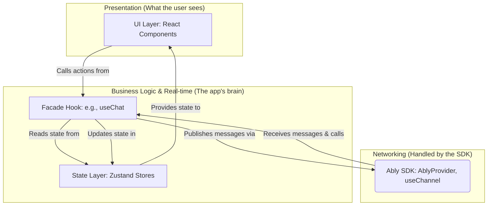

# Ably-Powered MVP Architecture for Real-Time Expo Apps

This document outlines a pragmatic, high-velocity architecture for a real-time Expo application using the official Ably React Native SDK. It is designed for rapid development without sacrificing clean separation of concerns, making it ideal for an MVP with a tight deadline.

## The Core Principle: Leverage the SDK, Abstract with Facades

Instead of building a networking layer from scratch, we leverage the power of Ably's purpose-built React Hooks. We then contain this external dependency within a "Facade Hook" (`useChat`), ensuring our UI components remain simple, declarative, and completely unaware of the underlying real-time service.

This gives us the best of both worlds: the development speed of a mature SDK and the long-term maintainability of a decoupled UI.



### 1. Infrastructure Layer (`<AblyProvider />`)

-   **Responsibility**: Manages the entire Ably connection lifecycle. It's a "set it and forget it" component provided by the SDK.
-   **Implementation**: You wrap your entire application with `<AblyProvider>`. This component uses React Context to give all child components (and hooks) access to the configured Ably client instance. There is **no custom `socketService.ts` required**.

### 2. State & Real-time Layer (Facade Hooks & Zustand Stores)

-   **Responsibility**: This is the bridge between the UI and the real-time service. It contains all the Ably-specific logic and manages the application's state.
-   **Key Components**:
    -   **Facade Hook (`hooks/useChat.ts`)**: This is the centerpiece. It uses Ably's `useChannel` hook to subscribe to a channel, listen for messages, and publish new messages. When a message is received, it calls an action on the Zustand store.
    -   **Zustand Store (`store/chatStore.ts`)**: Remains the **single source of truth** for the chat history. It holds the `messages` array and exposes actions (`addMessage`, `setMessages`) for the Facade Hook to call. The UI layer will read data directly from this store.

### 3. UI Layer (`app/**/*.tsx`)

-   **Responsibility**: Render the UI and handle user interactions.
-   **Key Characteristics**:
    -   **Ably-Agnostic**: Components have **zero** knowledge of Ably. They don't know if the data is coming from WebSockets, HTTP polling, or magic.
    -   **Declarative**: Components consume the Facade Hook (`useChat`) to get data and actions. They read `messages` from the hook and call `sendMessage`. That's it.
    -   **Lean**: All complex logic is abstracted away into the Facade Hook, keeping components focused on presentation.

---

## Full Code Implementation: A Simple Chat Feature with Ably

Here is the final, working code for each layer, demonstrating the architecture.

### Step 1: Install the SDK

First, add the Ably SDK to your project:
```bash
npm install ably
```

### Step 2: Infrastructure Setup (`app/_layout.tsx`)

Wrap your application layout with the `AblyProvider`. You'll get your API key from your Ably dashboard.

```typescript
import * as Ably from 'ably';
import { AblyProvider } from 'ably/react';
import { Stack } from 'expo-router';
import { env } from '~/config/env'; // Assuming you store your key here

// The Ably client is configured once with the user's token or API key.
// In a real app, you'd likely get a token from your backend after login.
const client = new Ably.Realtime({ key: env.ABLY_API_KEY, clientId: 'some-user-id' });

export default function RootLayout() {
  return (
    // The provider manages the connection for the entire app.
    <AblyProvider client={client}>
      <Stack>
        <Stack.Screen name="lobby" />
        {/* ... other screens ... */}
      </Stack>
    </AblyProvider>
  );
}
```

### Step 3: State Layer (`store/chatStore.ts`)

This store is almost identical to the original architecture. It knows nothing about Ably; it just holds state.

```typescript
import { create } from 'zustand';

// The shape of a message in our application state.
export interface Message {
  id: string; // from Ably
  clientId: string; // from Ably
  data: {
    text: string;
    user: string;
  };
  timestamp: number; // from Ably (Unix timestamp)
}

interface ChatState {
  messages: Message[];
  addMessage: (message: Message) => void;
  setHistory: (messages: Message[]) => void;
}

export const useChatStore = create<ChatState>((set) => ({
  messages: [],
  addMessage: (message) => {
    set((state) => ({ messages: [...state.messages, message] }));
  },
  setHistory: (messages) => set({ messages }),
}));
```

### Step 4: The Facade Hook (`hooks/useChat.ts`)

This is where the magic happens. We encapsulate all Ably logic here.

```typescript
import { useChannel } from 'ably/react';
import { useChatStore, Message } from '~/store/chatStore';
import { useAuthStore } from '~/store/authStore';
import { useEffect } from 'react';

const CHAT_CHANNEL = 'chat:main';

export const useChat = () => {
  const { addMessage, setHistory } = useChatStore((state) => ({
    addMessage: state.addMessage,
    setHistory: state.setHistory,
  }));
  const messages = useChatStore((state) => state.messages);
  const currentUser = useAuthStore((state) => state.user);

  // The useChannel hook does all the heavy lifting:
  // - Subscribes to the channel
  // - Listens for messages
  // - Exposes a `publish` function
  // - Cleans up automatically on unmount
  const { channel } = useChannel(CHAT_CHANNEL, (message: Message) => {
    // This callback runs for every new message on the channel.
    addMessage(message);
  });

  // Fetch initial history when the hook mounts
  useEffect(() => {
    const getHistory = async () => {
      const historyPage = await channel.history();
      // Ably returns history in reverse chronological order
      const pastMessages = historyPage.items.reverse();
      setHistory(pastMessages);
    };

    getHistory();
  }, [channel, setHistory]);

  const sendMessage = (text: string) => {
    if (!currentUser) return;
    // The `publish` method sends a message to all subscribers.
    channel.publish({
      name: 'message', // Event name
      data: { text, user: currentUser.firstName },
    });
  };

  const isMyMessage = (message: Message) => {
    return message.clientId === currentUser?.id; // Assuming user.id matches Ably clientId
  };

  // The hook returns a clean API for the UI.
  return { messages, sendMessage, isMyMessage };
};
```

### Step 5: The UI Component (`app/lobby.tsx`)

The UI component is clean and simple. It is identical to the one in the previous architecture, proving the abstraction works perfectly.

```typescript
import React, { useState, useEffect, useRef } from 'react';
import { View, Text, TextInput, TouchableOpacity, ScrollView } from 'react-native';
import { useChat } from '~/hooks/useChat'; // Consuming our clean facade hook
import { SafeAreaView } from 'react-native-safe-area-context';

export default function Lobby() {
  const [newMessage, setNewMessage] = useState('');
  const scrollViewRef = useRef<ScrollView>(null);
  // The component just calls our hook. It has no idea Ably exists.
  const { messages, sendMessage, isMyMessage } = useChat();

  useEffect(() => {
    setTimeout(() => scrollViewRef.current?.scrollToEnd(), 100);
  }, [messages]);

  const handleSend = () => {
    if (newMessage.trim()) {
      sendMessage(newMessage.trim());
      setNewMessage('');
    }
  };

  return (
    <SafeAreaView className="flex-1 bg-white">
      {/* ... UI JSX remains identical ... */}
      <ScrollView ref={scrollViewRef}>
        {messages.map((message) => {
          const isMine = isMyMessage(message);
          return (
            <View key={message.id}>
              <Text>{message.data.user}: {message.data.text}</Text>
            </View>
          );
        })}
      </ScrollView>
       {/* ... Message input JSX remains identical ... */}
    </SafeAreaView>
  );
}
```
