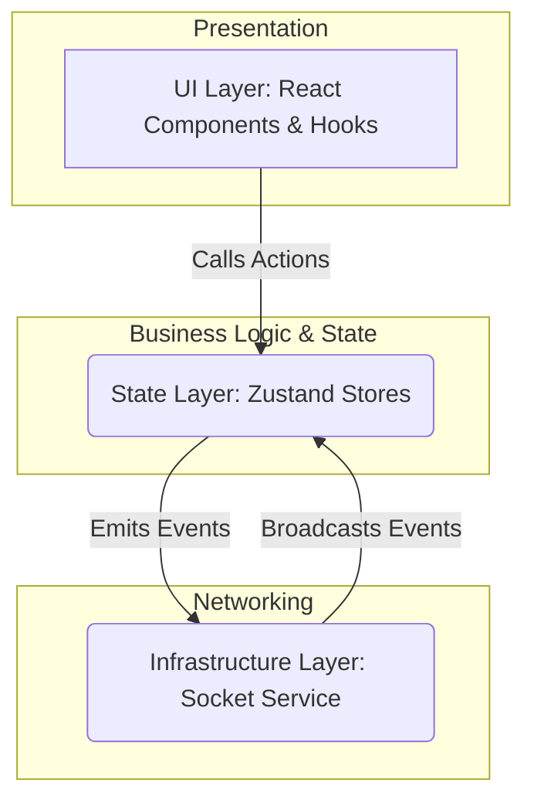

# Realtime Expo App - V2 Architecture

This document outlines a refined, professional-grade architecture for a scalable real-time application. It improves upon the original by fully decoupling the networking layer from the state management layer, resulting in a more modular, testable, and maintainable codebase.

## The Three-Layer Decoupled Architecture

The core principle is a strict, unidirectional data flow built on three distinct layers. Each layer has a single responsibility and is unaware of the layers above it.



#### 1. **Infrastructure Layer (`services/socketService.ts`)**
-   **Responsibility**: Manage the raw WebSocket connection and nothing else.
-   **Key Characteristics**:
    -   Completely stateless.
    -   No knowledge of Zustand, React, or any application-specific logic.
    -   Provides a clean, typed API for connecting, sending events, and subscribing to events.
    -   Uses TypeScript generics to ensure type safety between the client and server.

#### 2. **State Layer (`store/*.ts`)**
-   **Responsibility**: Manage all application state and business logic. This is the "source of truth" for the UI.
-   **Key Characteristics**:
    -   Built with Zustand stores (`useChatStore`, `useGameStore`, etc.).
    -   **Subscribes** to events from the `socketService` to update its state when messages arrive from the server.
    -   Provides actions that the UI layer can call. If these actions need to communicate with the server, they use the `socketService` to emit events.

#### 3. **UI Layer (`app/**/*.tsx`, `hooks/*.ts`)**
-   **Responsibility**: Render the UI and handle user interactions.
-   **Key Characteristics**:
    -   React components read data directly from Zustand stores.
    -   Custom hooks (`useChat`, `useAuth`) act as a **Facade**, providing a simple and clean API for components to use. They select state from stores and expose actions.
    -   When a user performs an action (e.g., clicks a "Send" button), the UI layer calls an action on a Zustand store.

---

## Data Flow Example: Sending a Chat Message

This flow demonstrates the clean separation of concerns.

1.  **UI Layer**: A user types a message in `lobby.tsx` and presses "Send". The component calls the `sendMessage` function from the `useChat` hook.
2.  **Hook (`useChat.ts`)**: The hook gets the `sendMessage` action from the `useChatStore`.
3.  **State Layer (`chatStore.ts`)**: The `sendMessage(text)` action is executed. It **does not** update its own state directly. Instead, it calls `emitSocketEvent('chat_message', { text })` from the `socketService`.
4.  **Infrastructure Layer (`socketService.ts`)**: The service sends the raw `chat_message` event to the server.
5.  **Server**: The server processes the message, adds a user ID and timestamp, and broadcasts it back to all clients (including the sender).
6.  **Infrastructure Layer (`socketService.ts`)**: The service receives the `chat_message` event from the server. Its internal event listener fires.
7.  **State Layer (`chatStore.ts`)**: The `initChatListeners()` function, which subscribed to the service, catches the event. It now calls its own `addMessage(payload)` action with the data from the server. The `messages` array in the store is updated.
8.  **UI Layer**: The `lobby.tsx` component, being subscribed to the `useChatStore`, automatically re-renders to display the new message.

This ensures the **server is the single source of truth**, preventing inconsistencies and race conditions.

---

## Code Implementation: A Simple Chat Feature

Here is how the code for each layer would look for a simple chat feature.

### Step 1: Infrastructure Layer (`services/socketService.ts`)

First, we define the events and create the generic service. This file has no dependencies on any other part of the app.

```typescript
import { io, Socket } from 'socket.io-client';

// Define the shape of events for full-stack type safety
export interface ServerToClientEvents {
  chat_message: (payload: { id: string; user: string; text: string }) => void;
}

export interface ClientToServerEvents {
  chat_message: (payload: { text: string }) => void;
}

const socket: Socket<ServerToClientEvents, ClientToServerEvents> = io('YOUR_SERVER_URL', {
  autoConnect: false,
});

export const connectSocket = () => {
  socket.connect();
};

export const emitSocketEvent = <Event extends keyof ClientToServerEvents>(
  event: Event,
  payload: Parameters<ClientToServerEvents[Event]>[0]
) => {
  socket.emit(event, payload);
};

export const subscribeToSocketEvent = <Event extends keyof ServerToClientEvents>(
  event: Event,
  callback: ServerToClientEvents[Event]
) => {
  socket.on(event, callback);
  // Return an unsubscribe function for cleanup
  return () => socket.off(event, callback);
};
```

### Step 2: State Layer (`store/chatStore.ts`)

The store manages chat state. It uses the `socketService` to send and receive messages.

```typescript
import { create } from 'zustand';
import { emitSocketEvent, subscribeToSocketEvent } from '@/services/socketService';

export interface Message {
  id: string;
  user: string;
  text: string;
}

interface ChatState {
  messages: Message[];
  sendMessage: (text: string) => void;
  addMessage: (message: Message) => void;
}

export const useChatStore = create<ChatState>((set) => ({
  messages: [],
  sendMessage: (text) => {
    // Action to send a message. It emits an event and waits
    // for the server to broadcast it back.
    emitSocketEvent('chat_message', { text });
  },
  addMessage: (message) => {
    // Action to add an incoming message to the state.
    set((state) => ({ messages: [...state.messages, message] }));
  },
}));

// This function initializes the listeners for the store.
// It subscribes to the socket service and calls store actions.
export const initChatListeners = () => {
  const unsubscribe = subscribeToSocketEvent('chat_message', (payload) => {
    useChatStore.getState().addMessage(payload);
  });

  // Return the cleanup function
  return unsubscribe;
};
```

### Step 3: UI Layer - The Hook (`hooks/useChat.ts`)

The custom hook acts as a facade, providing a clean API for the UI components. It selects only the necessary state and actions from the store.

```typescript
import { useChatStore } from '@/store/chatStore';

export const useChat = () => {
  // Select the state and actions needed by the UI
  const messages = useChatStore((state) => state.messages);
  const sendMessage = useChatStore((state) => state.sendMessage);

  return { messages, sendMessage };
};
```

### Step 4: UI Layer - The Component (`app/lobby.tsx`)

The component is simple. It uses the `useChat` hook and is only concerned with rendering and handling user input.

```typescript
import { useState } from 'react';
import { View, TextInput, Button, FlatList, Text } from 'react-native';
import { useChat } from '@/hooks/useChat';

export default function LobbyScreen() {
  const { messages, sendMessage } = useChat();
  const [newMessage, setNewMessage] = useState('');

  const handleSend = () => {
    if (newMessage.trim()) {
      sendMessage(newMessage.trim());
      setNewMessage('');
    }
  };

  return (
    <View>
      <FlatList
        data={messages}
        renderItem={({ item }) => <Text>{item.user}: {item.text}</Text>}
        keyExtractor={(item) => item.id}
      />
      <TextInput
        value={newMessage}
        onChangeText={setNewMessage}
        placeholder="Type a message..."
      />
      <Button title="Send" onPress={handleSend} />
    </View>
  );
}
```

### Step 5: Initialization (`app/_layout.tsx`)

Finally, we wire everything together in the main layout file. This ensures our listeners are set up when the app starts.

```typescript
import { useEffect } from 'react';
import { connectSocket } from '@/services/socketService';
import { initChatListeners } from '@/store/chatStore';
// ... other imports

export default function RootLayout() {
  useEffect(() => {
    // Connect to the socket
    connectSocket();

    // Initialize the chat listeners
    const unsubscribeChat = initChatListeners();
    // const unsubscribeGame = initGameListeners(); // etc.

    // Return a cleanup function to run on component unmount
    return () => {
      unsubscribeChat();
      // unsubscribeGame();
    };
  }, []);

  return (
    // ... your layout JSX
  );
}
```

## How to Scale: Adding a New Feature

This architecture shines when adding new features. To add "Game" functionality:

1.  **Define Events**: Add `game_started` and `player_moved` to the event types in `socketService.ts`.
2.  **Create Store**: Create a `store/gameStore.ts` file. Define the state (e.g., `players`, `gameState`) and actions (`updatePlayerPosition`).
3.  **Create Initializer**: In `gameStore.ts`, create and export an `initGameListeners()` function. This function will `subscribeToSocketEvent('player_moved', ...)` and call the appropriate actions.
4.  **Wire It Up**: In `app/_layout.tsx`, import `initGameListeners` and call it once on app startup.

The `socketService` remains untouched. The chat feature remains untouched. The new logic is perfectly encapsulated.

This approach provides a robust, scalable, and highly professional foundation for your real-time application.
